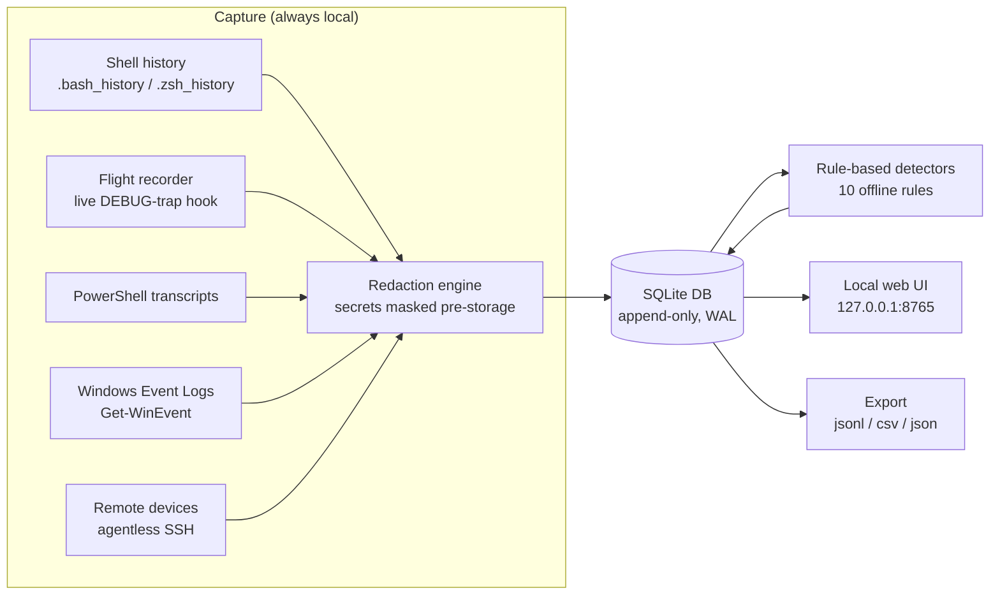

# Retrace

**Deterministic, offline terminal intelligence.** Record. Replay. Analyze. Secure.

Retrace is a local-first terminal flight recorder that captures shell history, live terminal sessions, PowerShell transcripts, and Windows Event Logs — then runs rule-based detection to surface suspicious activity. It is **agentic-free by design**: the core value is delivered by deterministic, offline code. No LLM is required. No data leaves your machine unless you explicitly export it.

> **The philosophy:** the logs are already on your machine. Retrace doesn't invent new data — it aggregates what already exists, redacts the secrets, and makes it searchable, replayable, and auditable. Intelligent code, not agentic AI.

---

## Table of Contents

- [What Retrace Does](#what-retrace-does)
- [Architecture](#architecture)
- [Codebase Walkthrough](#codebase-walkthrough)
- [Installation](#installation)
  - [Quick Install (Linux / macOS / WSL2)](#quick-install-linux--macos--wsl2)
  - [Quick Install (Windows)](#quick-install-windows)
  - [Manual Install](#manual-install)
  - [Uninstall](#uninstall)
- [Usage](#usage)
  - [Core Commands](#core-commands)
  - [Remote Device Collection](#remote-device-collection)
  - [Optional Local Model Analysis](#optional-local-model-analysis)
  - [Web UI](#web-ui)
- [Security Model](#security-model)
- [Detection Rules](#detection-rules)
- [Persistence](#persistence)
- [Project Layout](#project-layout)
- [Roadmap](#roadmap)
- [License](#license)

---

## What Retrace Does



**The full loop, end-to-end:**

1. **Capture** — ingest shell history (`bash`/`zsh`/PowerShell), live flight-recorder spool, PowerShell transcripts, Windows Event Logs, and (optionally) remote device logs over SSH.
2. **Redact** — secrets (PATs, JWTs, Bearer tokens, `KEY=value` pairs) are masked **before anything is stored**. High-entropy strings are flagged, never stored raw.
3. **Store** — append-only SQLite with WAL mode, file permissions locked to the current user.
4. **Detect** — 10 built-in deterministic rules (pipe-to-shell, `curl|sh` supply-chain, secret-on-CLI, auth-failure spikes, destructive commands, exfiltration patterns, long-running commands, and more). User-extensible via JSON config.
5. **View** — a local-only web UI at `http://127.0.0.1:8765` for timeline replay and alert review.
6. **Export** — explicit, user-triggered export to JSONL/CSV/JSON for analysis in other tools.

**What Retrace is *not*:** it is not a keylogger for surveillance, not a cloud service, not an agentic AI that makes decisions. It is a **personal audit trail** — a flight recorder for your terminal — that respects the boundary of your machine.

---

## Architecture

| Layer | Module | Responsibility |
|-------|--------|----------------|
| **Capture** | `retrace/collectors/history.py` | Parse `.bash_history`, `.zsh_history`, PowerShell PSReadLine history |
| | `retrace/flight_recorder.py` | Live DEBUG-trap hook → JSONL spool → `ingest --flight` |
| | `retrace/ps_transcript.py` | PowerShell `Start-Transcript` capture + idempotent parser |
| | `retrace/collectors/windows_events.py` | `Get-WinEvent` → Security/System/Application/PowerShell channels |
| | `retrace/remote.py` | Agentless SSH collector for remote devices |
| **Redact** | `retrace/redact.py` | Secret masking + Shannon-entropy flagging, pre-storage |
| **Store** | `retrace/db.py` | SQLite schema, WAL, perms-locked, append-only |
| **Detect** | `retrace/detectors.py` | Deterministic rule engine (10 built-ins, JSON-extensible) |
| **Loop** | `retrace/agent.py` | Persistent agent (systemd-friendly), health state file |
| | `retrace/watch.py` | Simpler watch daemon (ingest + detect on interval) |
| **View** | `retrace/webui.py` | Local-only HTTP server, single self-contained HTML page, JSON API |
| **Model (opt-in)** | `retrace/models.py` | Ollama / OpenAI-compatible local endpoints; never required |
| **CLI** | `retrace/cli.py` | `retrace` / `rec` command surface |
| **Install** | `scripts/install.sh`, `scripts/install.ps1` | One-command installers for Linux/macOS/WSL2/Windows |
| **Persistence** | `systemd/retrace-agent.service`, `systemd/retrace-web.service` | systemd user units |
| | `scripts/retrace-win.ps1` | Windows Task Scheduler registration |

**Design principles:**

- **Zero runtime dependencies** — the entire core is Python 3.9+ **stdlib only**. No pip installs, no venv, no requirements.txt. Clone → run.
- **Append-only honesty** — rows are immutable once written; replay timelines cannot be rewritten.
- **Redaction-first** — secrets are masked at the boundary, before storage, and the original text is discarded (not reversible).
- **No network by default** — the web UI binds strictly to `127.0.0.1`. No telemetry, no CDN, no external assets.
- **Deterministic over agentic** — the capture/detect loop never depends on a model. A model, if enabled, is an opt-in advisory layer that only ever sees redacted text and can never modify or delete command rows.

---

## Codebase Walkthrough

```
Retrace/
├── retrace/
│   ├── __init__.py                  # Package metadata (v0.1.0)
│   ├── cli.py                       # `retrace` / `rec` command surface
│   ├── db.py                        # SQLite storage: schema, connect, insert, search, stats
│   ├── redact.py                    # Secret masking + entropy flagging
│   ├── flight_recorder.py           # Live bash/zsh DEBUG-trap hook + spool ingest
│   ├── ps_transcript.py             # PowerShell transcript hook + parser
│   ├── detectors.py                 # Rule engine: 10 built-in rules + user config
│   ├── agent.py                     # Persistent loop: capture→detect→model(opt-in)→state
│   ├── watch.py                     # Simpler daemon: periodic ingest + detect
│   ├── webui.py                     # Local-only HTTP server + single-page UI
│   ├── models.py                    # Opt-in local model providers (ollama / openai-compat)
│   ├── remote.py                    # Agentless SSH remote collector
│   └── collectors/
│       ├── __init__.py
│       ├── history.py               # bash/zsh/PowerShell history parsers
│       └── windows_events.py        # Get-WinEvent collector (Security/System/Application/PowerShell)
├── scripts/
│   ├── install.sh                   # One-command installer (Linux/macOS/WSL2)
│   ├── install.ps1                  # One-command installer (Windows)
│   ├── uninstall.sh                 # Symmetric uninstaller
│   ├── retrace-win.ps1              # Windows Task Scheduler persistence
│   ├── retrace-run-agent.ps1        # Windows agent runner
│   └── retrace-run-web.ps1          # Windows web UI runner
├── systemd/
│   ├── retrace-agent.service        # systemd user unit — persistent agent
│   └── retrace-web.service          # systemd user unit — web UI
├── tests/
│   └── test_ps_parser.py            # PowerShell transcript parser tests
├── pyproject.toml                   # Packaging (installs `retrace` + `rec` entry points)
├── LICENSE                          # MIT
└── README.md
```

### Data model (`retrace/db.py`)

**`commands`** — one row per captured command:

| Column | Type | Meaning |
|--------|------|---------|
| `id` | TEXT (PK) | 12-char UUID |
| `ts` | REAL | Epoch seconds (UTC) |
| `source` | TEXT | `history` \| `flight` \| `remote` \| `import` |
| `shell` | TEXT | `bash` \| `zsh` \| `powershell` \| `cmd` |
| `command` | TEXT | **Redacted** command text |
| `cwd` | TEXT | Working directory |
| `exit_code` | INT | Process exit code |
| `duration_ms` | INT | Execution duration |
| `session_id` | TEXT | Session identifier |
| `host` | TEXT | Machine name |
| `git_repo` / `git_branch` / `git_dirty` | TEXT/INT | Git context when available |
| `entropy` | INT | 1 if high-entropy (likely secret) token flagged |
| `raw_output` | TEXT | Redacted captured output (flight only) |

**`alerts`** — one row per fired rule: `id`, `ts`, `rule`, `severity`, `message`, `count`, `first_ts`, `last_ts`, `samples`, `acked`.

### Redaction engine (`retrace/redact.py`)

- Whole-line assignment redaction: `export TOKEN=...` → `export TOKEN=[REDACTED]`
- Known secret shapes: GitHub PATs (`ghp_`, `github_pat_`), Slack (`xox*`), AWS keys (`AKIA*`), OpenAI-style (`sk-*`), JWTs (`eyJ...`)
- Inline `key=value` pairs where the key looks secret-ish
- `Bearer <token>` sequences
- Shannon-entropy flagging for unknown high-entropy tokens (the flag is stored, the token is not)

### Detector engine (`retrace/detectors.py`)

Every rule is a pure function over the captured command stream — no LLM, no network. Rules are declarative and user-extensible via `~/.config/retrace/detectors.json`. See [Detection Rules](#detection-rules) for the built-in set.

---

## Installation

### Prerequisites

- **Python 3.9+** (stdlib only — no pip dependencies)
- **git** (to clone)
- **SSH keys** (only if you plan to collect from remote devices)

### Quick Install (Linux / macOS / WSL2)

```bash
git clone https://github.com/Nooran3994/Retrace.git
cd Retrace
./scripts/install.sh
```

The installer does everything, idempotently (safe to re-run):

1. Detects platform (native Linux / macOS / WSL2 / Windows)
2. Verifies Python 3.9+
3. Initializes config + data directories + SQLite DB
4. Installs the shell flight-recorder hook (`~/.bashrc`, `~/.zshrc`, or fish)
5. Registers persistence:
   - **Linux / WSL2 with systemd** → systemd user units (`retrace-agent`, `retrace-web`)
   - **WSL2 without systemd** → falls back to Windows Task Scheduler
   - **macOS** → systemd user units (or cron fallback)
6. Starts the local-only web UI on `http://127.0.0.1:8765`
7. Prints a summary with next commands

**Installer options:**

```bash
RETRACE_PORT=9000 ./scripts/install.sh        # custom web port
RETRACE_NO_WEB=1 ./scripts/install.sh         # skip web UI
RETRACE_NO_PERSIST=1 ./scripts/install.sh     # skip systemd/Task Scheduler
RETRACE_NO_HOOK=1 ./scripts/install.sh        # skip shell hook
```

### Quick Install (Windows)

```powershell
git clone https://github.com/Nooran3994/Retrace.git
cd Retrace
powershell -ExecutionPolicy Bypass -File scripts\install.ps1
```

The Windows installer:

1. Detects the Python launcher (`py`)
2. Initializes config + data directories + SQLite DB (`%LOCALAPPDATA%\retrace\rec.db`)
3. Installs the PowerShell transcript hook
4. Registers **Task Scheduler** tasks (`retrace-agent`, `retrace-web`) for persistence
   — uses `schtasks.exe` per-user registration when run without admin rights,
   so it works from a normal (non-elevated) terminal; falls back to
   `Register-ScheduledTask` when elevated
5. Starts the local-only web UI
6. Prints a summary

### Manual Install

```bash
# From the repo root
python3 -m retrace.cli stats          # creates the DB + config dirs
python3 -m retrace.cli hook install   # installs the bash flight-recorder hook
# Open a NEW terminal, then:
python3 -m retrace.cli ingest         # pull existing shell history
python3 -m retrace.cli web            # start the local UI
```

Or install the CLI entry points:

```bash
pip install -e .
retrace stats
```

### Uninstall

```bash
./scripts/uninstall.sh        # removes hooks, systemd units, Task Scheduler tasks, DB
./scripts/uninstall.sh --keep-data   # keep the database
```

---

## Usage

### Core Commands

| Command | What it does |
|---------|--------------|
| `retrace ingest` | Ingest existing shell history into the DB |
| `retrace ingest --flight` | Load flight-recorder spool (live session data) |
| `retrace ingest --ps` | Load PowerShell transcripts |
| `retrace hook install` | Install the bash flight-recorder hook |
| `retrace hook install-ps` | Install the PowerShell transcript hook |
| `retrace win-events` | Collect Windows Event Log entries (`--minutes`, `--channels`) |
| `retrace search <query>` | Search captured commands (`--limit`, `--since`) |
| `retrace stats` | Show aggregate stats (total, by source, last capture) |
| `retrace detect` | Run rule-based detectors over recent records (`--since`, `--limit`) |
| `retrace detect --init-config` | Write an example `detectors.json` to extend the rules |
| `retrace web` | Start the local-only web UI (`--port`, default 8765) |
| `retrace watch` | Run the watch daemon (periodic ingest + detect; `--interval`, `--once`) |
| `retrace agent` | Run the persistent agent loop (systemd-friendly; `--interval`, `--once`, `--no-model`) |
| `retrace export --format jsonl` | Export records (`jsonl` / `csv` / `json`; `--output <file>`) |

**Examples:**

```bash
# See what's captured
retrace stats

# Search your command history
retrace search "kubectl"
retrace search "git" --limit 20 --since 60

# Run the security detectors
retrace detect --since 60

# Export for analysis in another tool
retrace export --format jsonl --output my-session.jsonl
retrace export --format csv --output my-session.csv

# Open the local UI
retrace web   # → http://127.0.0.1:8765
```

### Remote Device Collection

Retrace collects logs from other machines **agentlessly** — nothing is installed on the remote, nothing persistent to compromise. Transport is SSH only (encrypted, `BatchMode=yes`, keys only — no credentials stored).

```bash
# Register a device
retrace remote add <name> <host> --user <ssh-user> --port 22

# List registered hosts
retrace remote list

# Verify SSH connectivity
retrace remote test <name>

# Collect from one host (reads history + flight spool, redacts, ingests)
retrace remote collect <name>

# Collect from every registered host
retrace remote collect --all

# Review the exact script that runs on the remote (read-only)
retrace remote script
```

The `retrace watch` / `retrace agent` loops automatically pull from all registered remotes each cycle.

### Optional Local Model Analysis

Retrace's core works **without any model**. Model analysis is strictly opt-in, runs against a **local** model server, and only ever sees **redacted** text. Model output is advisory — it may insert insight rows into the alerts table but can never modify or delete command rows.

**With Ollama (fully offline):**

```bash
# 1. Install Ollama (https://ollama.com) and pull a model
ollama pull llama3.2:3b

# 2. Enable model analysis in Retrace
retrace config set model.provider ollama
retrace config set model.url http://127.0.0.1:11434
retrace config set model.model llama3.2:3b
retrace config set model.enabled true

# 3. Run the agent with model analysis
retrace agent --interval 60
```

**With any OpenAI-compatible local server** (LM Studio, llama.cpp, vLLM):

```bash
retrace config set model.provider openai
retrace config set model.url http://127.0.0.1:1234/v1
retrace config set model.model local-model
retrace config set model.enabled true
```

**Integrity guarantees:**

- If no provider is configured or reachable, Retrace runs fully deterministic — capture and detection never depend on a model.
- Only redacted text is ever sent to a model.
- Model output cannot modify or delete command rows.

### Web UI

The web UI binds **strictly to `127.0.0.1`** — never `0.0.0.0`. No external assets, no CDN, no telemetry. The entire frontend is a single self-contained HTML page served from memory. Data never leaves the machine.

**Routes:**

| Route | Purpose |
|-------|---------|
| `GET /` | The UI (single-page app) |
| `GET /api/stats` | Aggregate stats |
| `GET /api/records` | Recent records (`?limit=`, `?q=`) |
| `GET /api/alerts` | Persisted alerts (`?since=minutes`) |
| `POST /api/detect` | Run detectors now, persist, return alerts |
| `POST /api/alerts/ack` | Acknowledge an alert `{id}` |

---

## Security Model

| Threat | How Retrace Mitigates It |
|--------|--------------------------|
| **Data exfiltration** | Zero outbound network calls by default. Web UI is localhost-only. Export requires explicit user action. |
| **Secret leakage** | Redaction at capture + entropy flagging → secrets never stored raw. |
| **Unauthorized access** | DB file perms locked to current user; optional encryption-at-rest via OS. |
| **Malicious code execution** | Retrace only *observes*; it doesn't execute commands. The remote collector script is read-only. |
| **Supply chain compromise** | Stdlib-only core (no dependency tree). Installer is idempotent and inspectable. |
| **False sense of security** | UI labels: `LOCAL ONLY — 127.0.0.1` badge; model analysis is clearly opt-in. |

**Key rules:**

1. **Redaction-first** — secrets are masked before storage, and the original text is discarded (not reversible).
2. **Local-only by default** — the web UI binds to `127.0.0.1`, never `0.0.0.0`.
3. **Append-only SQLite** — rows immutable once written; WAL mode; perms locked.
4. **Deterministic detection** — the capture/detect loop never depends on a model.
5. **Export is explicit** — data leaves only when you run `retrace export`.

---

## Detection Rules

10 built-in rules, all deterministic and offline. User-extensible via `~/.config/retrace/detectors.json`.

| Rule | Severity | Detects |
|------|----------|---------|
| `pipe-to-shell` | high | Command pipes to a shell interpreter (RCE pattern) |
| `curl-pipe-shell` | critical | `curl`/`wget` piped straight into a shell — classic supply-chain RCE |
| `secret-in-command` | high | Likely secret material on the command line |
| `privilege-escalation` | medium | `sudo -i`, `su -`, `sudo su` |
| `destructive-command` | critical | `rm -rf /`, `dd` to `/dev/`, fork-bomb |
| `exfiltration-pattern` | high | Reverse shell / encoded payload patterns |
| `auth-failure-spike` | medium | 3+ auth failures in 10 minutes |
| `long-running-command` | info | Command ran > 5 minutes (possible hang) |
| `kill-process-family` | medium | Bulk force-kill of processes |
| `suspicious-download` | medium | Downloading executables/archives from the internet |

**Extending the rules:**

```bash
retrace detect --init-config   # writes ~/.config/retrace/detectors.json
# Edit the file, add your own rules, disable built-ins with "enabled": false
```

---

## Persistence

| Platform | Mechanism | Units/Tasks |
|----------|-----------|-------------|
| Linux | systemd user units | `retrace-agent.service`, `retrace-web.service` |
| WSL2 (with systemd) | systemd user units | same as Linux |
| WSL2 (without systemd) | Windows Task Scheduler (via `retrace-win.ps1`) | `retrace-agent`, `retrace-web` |
| Windows | Windows Task Scheduler | `retrace-agent`, `retrace-web` |
| macOS | systemd user units (or cron fallback) | same as Linux |

**Managing services:**

```bash
# Check status
systemctl --user status retrace-agent
systemctl --user status retrace-web

# View logs
journalctl --user -u retrace-agent -f

# Stop / start / restart
systemctl --user stop retrace-agent
systemctl --user start retrace-agent
systemctl --user restart retrace-agent

# Disable auto-start
systemctl --user disable --now retrace-agent
```

The agent writes a health state file (`~/.local/share/retrace/state.json`) with last-cycle timing and error summary — consumed by the web UI for monitoring.

---

## Project Layout

```
Retrace/
├── retrace/            # Python package (stdlib-only core)
├── scripts/            # Installers + Windows persistence
├── systemd/            # systemd user units
├── tests/              # Unit tests
├── pyproject.toml      # Packaging
├── LICENSE             # MIT
└── README.md
```

---

## Roadmap

- [x] Phase 1 — history ingest, redaction, query, export
- [x] Phase 2 — Windows Event Logs, PowerShell transcripts, detectors
- [x] Phase 3 — local web UI, watch daemon, persisted alerts
- [x] Remote device agent (opt-in SSH collector)
- [x] Optional local-LLM analysis (Ollama / OpenAI-compatible, no API calls)
- [x] Persistent agent (systemd + Windows Task Scheduler)
- [x] One-command installer (Linux / macOS / WSL2 / Windows)

---

## License

MIT