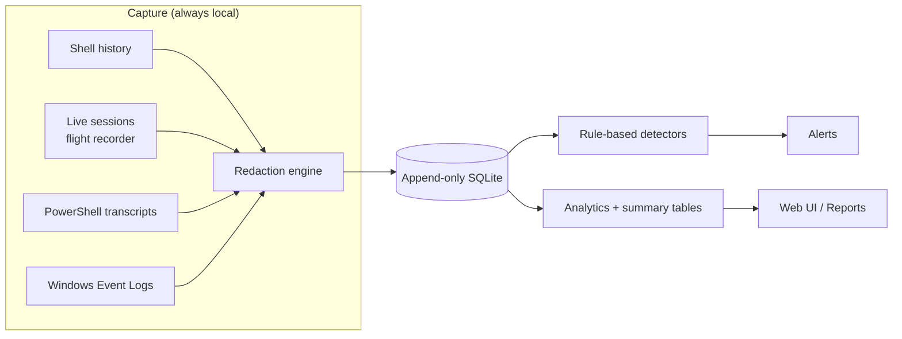

# Architecture

Retrace is a local-first terminal flight recorder. This page describes how the pieces fit together.

## High-level flow

## Components

| Module | Responsibility |
|---|---|
| `retrace/cli.py` | Command-line interface; dispatches every command |
| `retrace/webui.py` | Local HTTP server + tabbed SPA (dashboard, reports, settings, maintenance) |
| `retrace/analytics.py` | Read-only SQL aggregations: overview, time series, top commands, heatmap, percentiles |
| `retrace/summary.py` | Materialized rollup tables refreshed incrementally — makes dashboard loads O(window) instead of O(n) |
| `retrace/reports.py` | HTML (printable to PDF), CSV, and JSON report generators |
| `retrace/settings.py` | Control-plane bridge: config read/write, detector CRUD, remotes, background job runner |
| `retrace/db.py` | SQLite access layer (WAL mode, append-only core tables) |
| `retrace/detectors.py` | Deterministic rule-based detection |
| `retrace/redact.py` | Secret masking at the ingest boundary |

## Design principles

1. **Stdlib only** — Python 3.9+, zero pip dependencies for the core.
2. **Local-first** — no telemetry, no CDN, no network calls unless the user explicitly triggers them (export, remote collect).
3. **Deterministic over agentic** — capture/detect never depends on a model. Model analysis is opt-in and advisory.
4. **Redaction-first** — any new data source passes through the redaction engine before storage. Secrets are masked at the boundary, never stored raw.
5. **Append-only** — command/alert rows are immutable once written. No UPDATE/DELETE paths on the core tables.

## Data flow in detail

1. **Capture** — collectors read shell history (`.bash_history`, `.zsh_history`), live flight-recorder sessions, PowerShell transcripts, and Windows Event Logs.
2. **Redact** — secrets (tokens, keys, high-entropy strings) are masked at the boundary. The original is discarded.
3. **Store** — redacted records are appended to SQLite (WAL mode, perms-locked, immutable rows).
4. **Detect** — rule-based detectors scan recorded data and emit alerts (e.g., pipe-to-shell, curl-pipe-shell, destructive commands).
5. **Analyze** — the analytics engine aggregates on demand; summary tables keep it fast.
6. **View** — the web UI renders charts, timelines, alerts, and settings; reports export the same data.

## Why summary tables?

Raw analytics scans the full table (O(n)) on every cold request. Summary tables pre-aggregate by hour/day and refresh incrementally, so dashboard and report queries stay O(window) regardless of database size. Measured on a 1.1M-row DB: cold dashboard **~16s → ~2s**, with exact totals preserved (verified 1,125,116 = 1,125,116).

## Branch model

- `main` — stable, shippable
- `develop` — integration
- `feature/*` — one per phase (web-dashboard, reports, settings-ui, perf-summary)

See [CONTRIBUTING](../CONTRIBUTING.md) for commit conventions.