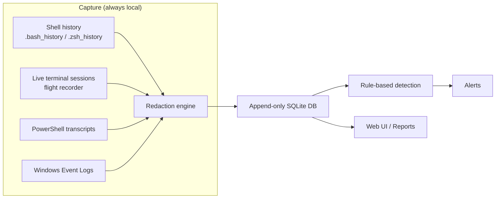

# Retrace Wiki

Welcome to the Retrace wiki. Retrace is a **deterministic, offline terminal intelligence** tool — a local-first terminal flight recorder that captures shell history, live terminal sessions, PowerShell transcripts, and Windows Event Logs, then runs rule-based detection to surface suspicious activity.

## Quick links

- [Installation](Installation)
- [Usage](Usage)
- [Web UI](Web-UI)
- [Architecture](Architecture)
- [Security Model](Security-Model)
- [Detection Rules](Detection-Rules)
- [Reports & Export](Reports)
- [Remote Collection](Remote-Collection)
- [Persistence & Data Model](Persistence)
- [FAQ](FAQ)

## What Retrace does



## Philosophy

> The logs are already on your machine. Retrace doesn't invent new data — it aggregates what already exists, redacts the secrets, and makes it searchable, replayable, and auditable. Intelligent code, not agentic AI.

- **Local-first** — nothing leaves your machine unless you explicitly export it.
- **Deterministic** — no LLM required; the core value is delivered by offline, rule-based code.
- **Redaction-first** — secrets are masked at the boundary, never stored raw.
- **Append-only** — recorded data is immutable once written.

## Project layout

```
retrace/
├── cli.py          # Command-line interface
├── webui.py        # Local web UI (dashboard, reports, settings)
├── analytics.py    # Read-only analytics engine
├── summary.py      # Materialized summary tables (fast dashboard)
├── reports.py      # HTML/CSV/JSON report generators
├── settings.py     # Config/detectors/remotes control plane
├── db.py           # SQLite access
├── detectors.py    # Rule-based detection
├── redact.py       # Secret redaction
└── ...             # collectors, agent, remote, etc.
```

## Contributing

- Read [CONTRIBUTING](../CONTRIBUTING.md) before opening a PR.
- Follow the [Code of Conduct](../CODE_OF_CONDUCT.md).
- Use [Conventional Commits](https://www.conventionalcommits.org/).