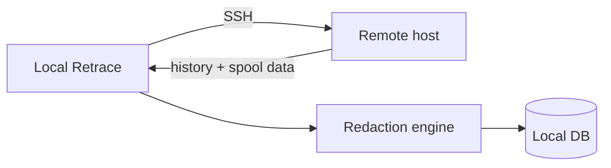

# Remote Collection

Retrace can collect terminal activity from **remote hosts over SSH** — without installing anything on the remote machine.

## How it works

The remote only needs an SSH daemon and a shell. All parsing and redaction happens locally at ingest; nothing is installed remotely.

## Registering a remote

From the **Settings → Remotes** tab (or `retrace/remote.py`):

| Field | Example |
|---|---|
| Name | `prod-web-01` |
| Host | `192.168.1.50` |
| User | `deploy` |
| Port | `22` |

Then click **Test** to verify the SSH connection, and **Collect** (or run `retrace collect-remote`) to pull data.

## Requirements on the remote

- SSH daemon running
- A shell (bash/sh) accessible via SSH
- Read access to the user's shell history

No agent binary, no root, no installation.

## Security notes

- Remote collection is **opt-in and explicit** — nothing connects outbound automatically.
- Data is redacted **locally** at ingest, same as local sources.
- Credentials for remotes are stored in your local config — keep the config file permissions locked.

## Managing remotes from the UI

- **Remotes tab** — see registered hosts + per-host record counts
- **Settings → Remotes** — add / remove / test hosts
- **Settings → Actions → collect remotes** — pull from all registered hosts in a background job (pollable via the jobs API)